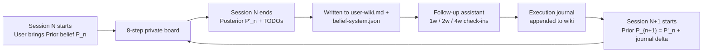
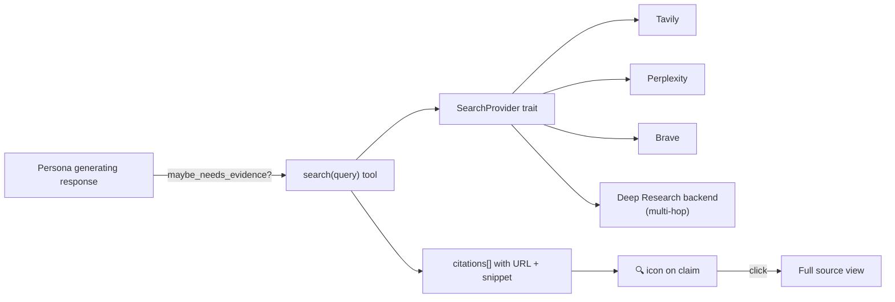
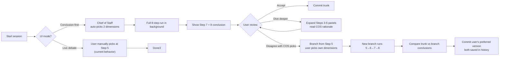
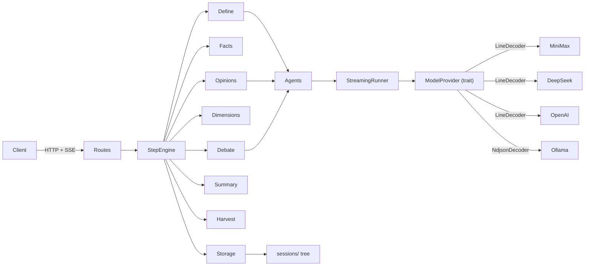

## 1. Root cause, in one paragraph

The current cascade is not a single bug — it is a **pattern**: every step runs the model **twice per agent** (once streaming to emit SSE, once non-streaming to collect the final string), SSE is parsed line-by-line **on each raw TCP chunk** (so any line split across packets is dropped), all stream parse errors are **swallowed silently** with `if let Ok(chunk) = ...`, step-level failures are swallowed with `let _ = run_debate(...)`, and token metrics use `total_tokens / 2` instead of the real `usage` the providers already return. The symptom is **80 zero-byte files** under `sessions/**/03-opinions/`, metrics where `prompt_tokens == completion_tokens`, and every downstream step receiving partial or empty context. Fixing any one layer alone will not hold — the remedy has to be structural.

## 2. Shape of the fix (6 phases, roughly in order)

### Phase A — Build the safety net first (test harness)

Add a new `counsel-test-utils` crate with a scriptable `MockModelProvider`:
- Returns deterministic streaming chunks from a fixture string, optionally with `usage` on the terminal event.
- Can be scripted to return an HTTP error, a malformed SSE line, a split-packet boundary, or an abrupt disconnect for any numbered call.

Add `crates/counsel-api/tests/integration.rs` using `axum::Router` + `tower::ServiceExt` in-process. Scenarios:
- `happy_path_full_8_steps` — all 12 opinion files are non-empty; `06-summary.md`, `07-harvest.md` non-empty; `metrics.json` has `prompt_tokens != completion_tokens`.
- `persona_stream_error` — one persona returns HTTP 500; the other 11 succeed; session status clearly records the failed persona; no 0-byte files are written.
- `sse_event_order` — asserts `step_start → persona_start(12) → persona_chunk(*) → persona_done(12) → step_done` ordering.
- `malformed_stream_line` — split-packet SSE line is reassembled, not dropped.

This is scaffolding for the rest of the plan — every phase below will add to this test before touching production code.

### Phase B — Streaming correctness (the single biggest win)

**B.1 — Eliminate the double API call.** New `Agent::run_streaming_collect(messages, opts, sink) -> Result<(String, Option<Usage>)>`. It makes **one** provider call, forks each delta to the SSE sink **and** a local `String` buffer, and returns both on end-of-stream. Replace every `run_streaming(...).await?; run(...).await?` pair in [`crates/counsel-core/src/steps/mod.rs`](crates/counsel-core/src/steps/mod.rs) with this one call. That single change halves token cost and eliminates the opinion-cascade.

**B.2 — Shared line-buffered SSE decoder.** New `counsel-model::sse::LineDecoder` that buffers partial bytes across `bytes_stream()` chunks, emits complete `data: ...\n` frames, and handles `data: [DONE]`. Every provider ([`minimax.rs`](crates/counsel-model/src/minimax.rs), [`deepseek.rs`](crates/counsel-model/src/deepseek.rs), [`openai.rs`](crates/counsel-model/src/openai.rs), [`kimi.rs`](crates/counsel-model/src/kimi.rs), [`dmx.rs`](crates/counsel-model/src/dmx.rs), [`laozhang.rs`](crates/counsel-model/src/laozhang.rs)) uses it. [`ollama.rs`](crates/counsel-model/src/ollama.rs) gets an NDJSON variant.

**B.3 — Every provider checks HTTP status before streaming.** Status ≠ 200 returns `ModelError::Http { status, body }` with the body preview, so upstream sees `401 unauthorized` instead of an empty stream. Only [`deepseek.rs`](crates/counsel-model/src/deepseek.rs) currently does this.

**B.4 — Provider-level HTTP client with timeouts.** New `counsel-model::http::build_client()` returns a `reqwest::Client` with `connect_timeout(10s)`, `timeout(300s)` overall, connection-pool reuse. Every provider constructor uses it.

**B.5 — Stream usage is no longer lost.** Change `StreamingResponse` from `Stream<Item = ModelResult<String>>` to `Stream<Item = ModelResult<StreamEvent>>` where:

```rust
pub enum StreamEvent {
    Delta(String),
    Usage(Usage),
    Done,
}
```

DeepSeek/MiniMax/OpenAI emit `Usage` from the final chunk; agents record it; metrics stop lying.

**B.6 — Stream parse errors become `Err` items, not silent drops.** Every `if let Ok(chunk) = serde_json::from_str(...)` becomes `match ... { Ok(c) => ..., Err(e) => yield Err(ModelError::StreamParse(e.to_string())) }`.

### Phase C — Agent unification

- Merge [`agents/mod.rs`](crates/counsel-core/src/agents/mod.rs), [`agents/facilitator.rs`](crates/counsel-core/src/agents/facilitator.rs), [`agents/secretary.rs`](crates/counsel-core/src/agents/secretary.rs), and the empty [`agents/persona.rs`](crates/counsel-core/src/agents/persona.rs) stub into a single `agents.rs` module with one `StreamingRunner` helper. Each agent role (`Facilitator`, `Persona { id, name, ... }`, `Secretary`) keeps its SSE event mapping but shares the streaming loop.
- Fix the **UTF-8 slicing panic** at `BUFFER_THRESHOLD` in three places by using `char_indices()` to find a safe break, not a raw byte index.
- Empty-response check is consistent across all three agents.

### Phase D — Step flow + error propagation

**D.1 — Split [`steps/mod.rs`](crates/counsel-core/src/steps/mod.rs) (~1000 lines) into one file per step** under `crates/counsel-core/src/steps/`: `define.rs`, `facts.rs`, `opinions.rs`, `dimensions.rs`, `debate.rs`, `summary.rs`, `harvest.rs`, `shared.rs` (for `save_metrics`, `parse_dimensions`, `parse_todos_insights`). Each step is a free function; `CounselService` becomes a thin holder of `Arc<dyn ModelProvider>` + `Storage`.

**D.2 — Minimal `StepEngine` state record.** Each step writes a `step_status.json` entry: `{step: 4, state: "ok" | "partial" | "failed", failed_personas: [...], duration_ms, tokens}`. A subsequent step refuses to run if the previous one is `failed`.

**D.3 — Parallel task error aggregation.** `run_opinions` and the three `run_debate` join_sets collect all task results; if any persona fails, the step returns `Err` with the list of failed personas (instead of silently producing 0-byte files). Each persona gets **one retry** with 1s backoff on transient errors (HTTP 5xx, timeout).

**D.4 — Kill every silent error.** Audit checklist:
- [`routes/steps.rs`](crates/counsel-api/src/routes/steps.rs)`#L101` `let _ = service.run_debate(...)` → propagate
- [`routes/steps.rs`](crates/counsel-api/src/routes/steps.rs)`#L121` `let _ = update_session_step(...)` → propagate
- [`counsel-core/src/lib.rs`](crates/counsel-core/src/lib.rs)`#L87` `serde_json::to_string(self).unwrap_or_else(...)` → return `Result`
- `.await.ok()` on SSEEvent::Error sends → log the send failure at least
- [`files.rs`](crates/counsel-storage/src/files.rs)`#L21` `path.parent().unwrap()` → return `StorageError::InvalidPath`

### Phase E — API, config, security polish

- `main.rs` loads `config.toml` via the `toml` crate; env vars override TOML values; every current default has a documented source-of-truth.
- `CorsLayer::permissive()` → explicit origin allow-list from config (default: `http://localhost:*` only).
- `get_session_file` sanitizes `filename` — reject `..`, `/`, absolute paths, non-`[0-9a-zA-Z._-]` bytes.
- Optional bearer-token check behind a `security.auth_token` config key (off by default so local dev is frictionless).
- Every provider in `counsel-model` falls back to `std::env::var("{PROVIDER}_API_KEY")` when no explicit key is passed.

### Phase F — Prompt fixes, metrics polish, cleanup

- **Resolve persona-prompt contradictions** flagged by the audit (Musk 「可能」 ban vs. honest-boundary section; Munger stray quote; Jobs inverted Pareto). One-line edits — but **in the skill files under `/Users/a1-6/Documents/CC/counsel/skills/`**, which are now the source of truth (see Phase G.2). The `rich_persona_*` helpers in [`prompts.rs`](crates/counsel-core/src/prompts.rs) go away entirely.
- **Harmonize facts prompt counts** — `facts_user_prompt` says 0–2, `rich_persona_facts_prompt` says 2–3. Pick 1–2.
- **Real token counts in metrics** — if streaming returned `Usage`, use it; otherwise keep the heuristic but clearly mark it in `09-metrics.md` with `(est.)`.
- **Fix `09-metrics.md` "Total Tokens: ~0K" rounding** (integer division bug).
- **Delete or mark obsolete**: `test_synthesis` binary (it's just a prompt `printf` demo), `test_full_flow.js` (references `06-debate.md`/`07-summary.md`/`08-harvest.md` that don't exist). Replace with the new Rust integration test.
- **Write `DEVELOPMENT.md`** — architecture diagram, how to run, how to add a provider, SSE event contract, pointer to TS original for design context.

### Phase G — Re-align with original design intent

This phase is added after reading the original TS project at `/Users/a1-6/Documents/CC/counsel`. The Rust version drifted away from three key design decisions in the original. Putting them back is cheap and substantially improves cost, latency, and maintainability.

**G.1 — Step 2 is a deterministic state machine, not an LLM dialogue.**

The original's [`src/agents/step2-facilitator/stateMachine.ts`](../../../../Documents/CC/counsel/src/agents/step2-facilitator/stateMachine.ts) is a pure state machine: `INIT → QUESTIONING → CONFIRMING → LOCKED → DONE`. The user's intent is parsed by rules (`SELECT_DIMENSION`, `CONFIRM`, `REJECT` — [`intentParser.ts`](../../../../Documents/CC/counsel/src/agents/step2-facilitator/intentParser.ts)). It hits max 3 rounds and force-locks. **Zero LLM calls on the happy path.**

The Rust version's [`run_define`](crates/counsel-core/src/steps/mod.rs) instead does `auto_simulate` — calling the model multiple times AND using the model to simulate the user's replies. This is both expensive and nonsensical given the design.

Fix: port `stateMachine.rs` + `intent_parser.rs` into `crates/counsel-core/src/step2_state_machine/`, replace `run_define`'s guts with state-machine dispatch, keep LLM calls only as the `< 0.5` confidence fallback (and even that is off by default). In-memory session map keyed by `project_id/session_id`, with a small supervisor that evicts stale entries.

**G.2 — Persona prompts come from `skills/*/SKILL.md`, not hardcoded Rust.**

The original loads each persona's system prompt via [`loadSkillPrompt(persona)`](../../../../Documents/CC/counsel/src/personas/index.ts) from the authored `skills/{slug}/SKILL.md` files (~400 lines each, YAML frontmatter + full "thinking OS"). Updates require only editing the markdown file.

The Rust version has a **1990-line [`persona_prompts.rs`](crates/counsel-core/src/persona_prompts.rs)** duplicating this content, which is the root cause of the `name: andrej-karpathy-perspective` leak into `rich_persona_*` helpers.

Fix (TS-parity baseline): new `counsel-core::skills::SkillLoader` reads `<CARGO_MANIFEST_DIR>/../../skills/<slug>/SKILL.md` at startup, caches by persona id, and exposes `get(persona_id) -> &str`. The entire file content becomes the system prompt — no parsing, no YAML-name bug. Delete `persona_prompts.rs` entirely.

> **Superseded by Phase H.** Phase H.1-H.2 replace the flat SKILL.md directory with the Wisdom Persona KB schema (`skills/{slug}/{metadata.yml, theory.md, voice.md, situations/*.md}`). Phase G.2 ships first as a minimum-viable intermediate state — it gets us off the 1990-line hardcoded `persona_prompts.rs`; Phase H then restructures the directory itself. The `SkillLoader` introduced here becomes the scaffolding that Phase H.2's TheoryLoader + SituationCardLoader upgrade. Similarly, Phase G.2's small `personas.rs` const roster is expanded in Phase H.6 into a user-selectable PersonaRegistry covering both vision 12 + extended 9 (21 total).

Where should `skills/` actually live? Three options:
- **(a) Symlink / relative path to the TS original** — keeps a single source of truth across both projects, which matters only as long as both exist.
- **(b) Copy the 12 skill files into the Rust project under `counsel-rust-cursor/skills/`** — independent, but now the two projects can drift.
- **(c) Make the path configurable via `config.toml`** — `[skills] path = "../counsel/skills"` with default to project-local.

Recommendation: **(c)**. Default to project-local `./skills/` (copy once), allow override for anyone who wants to track the TS original.

**G.3 — Preserve the original TS SSE event names.**

The original frontend at [`public/api-bridge.js`](../../../../Documents/CC/counsel/public/api-bridge.js) consumes `persona_start`, `persona_chunk`, `persona_done`, `facilitator_chunk`, `facilitator_done`, `step_start`, `step_done` (with optional `data` payload on `step_done`). My earlier "Tier 3" plan wanted to rename `persona_done → persona_end` and `step_done → step_end`, which would break that frontend if ever resurrected.

Revised contract: **keep the original names as the base layer**, add new events alongside them, never rename.

```
step_start          { step }
persona_start       { id, name }              # id is NEW (was just name)
persona_chunk       { id, name, delta }       # id is NEW; "delta" kept as "chunk" for compat
persona_done        { id, name }
persona_usage       { id, name, tokens, duration_ms }   # NEW
facilitator_chunk   { chunk }
facilitator_done    { }
secretary_chunk     { chunk }                 # NEW — was overloaded onto facilitator_chunk
secretary_done      { }                       # NEW
step_done           { step, data? }           # data.state = "ok" | "partial" is NEW
error               { step?, persona?, kind, message }
```

`chunk` field stays `chunk` (not `delta`) for backward compat with `api-bridge.js`. New fields (`id`, per-event `_usage`) are purely additive — old clients ignore them.

### Phase H — Wisdom Persona KB architecture (product-quality lever)

This is the single biggest product-quality lever in the plan. It rebuilds the persona layer around Michael's Wisdom Persona KB Framework (see `wisdom-persona-kb-framework.md`). Empirical basis: WE-INDEX data shows flat-prompt personas (WEAK, avg 15-18/25) vs. KB-framework personas + multi-agent architecture (GOLDEN, avg 22.6/25 in Kimi). Without this layer, every Tier-1 structural fix downstream still produces WEAK outputs. With it, the same engine produces GOLDEN-capable outputs.

**H.1 — Persona directory schema.**

Each persona lives in a directory, not a flat file:

```
skills/{slug}/
├── metadata.yml         # identity, roles, active_by_default, research_enabled, eval_cases
├── theory.md            # worldview + lifeview + values + methodology (system-prompt floor)
├── voice.md             # signature phrases, rhythm, lexical markers (priming + eval anchor)
├── situations/          # N situation cards, YAML frontmatter + markdown
│   ├── 001-{slug}.md
│   └── ...
└── eval-bank/           # WE-INDEX cases attached to this persona
    └── WE-{ID}.yaml
```

`metadata.yml` schema: `{id, name_zh, name_en, emoji, roles: [advisor | red_team], active_by_default: bool, research_enabled: bool, eval_cases: [...]}`.

**H.2 — TheoryLoader + SituationCardLoader.**

New `counsel-core::kb` module reads the `skills/` tree at startup. `TheoryLoader` caches `theory.md` per persona. `SituationCardLoader` parses YAML frontmatter (pressure_fingerprint) + markdown body, caches cards per persona. Replaces the flat `SkillLoader` introduced in Phase G.2 as a transitional scaffolding.

**H.3 — PressureFingerprint + FingerprintExtractor.**

18-dimensional numeric struct in 3 groups (pressure / internal tension / decision structure) — matching Michael's framework §3:

| Group | Dimensions |
|---|---|
| Pressure (6) | time, resource, survival, competition, opinion, environment_uncertainty |
| Internal tension (5) | identity, emotion, morality, face, loneliness |
| Decision structure (3) | irreversibility, information_completeness, cost_asymmetry |

`FingerprintExtractor` is a new agent — runs as Step 1.6 after hypothesis is locked. Given raw input + defined topic + user-wiki, produces a fingerprint vector and persists as `00-fingerprint.json`. Small model is sufficient; cost is trivial.

**H.4 — In-memory fingerprint-similarity RAG.**

Each persona independently retrieves top-K situation cards (default K=3) from its own library, scored by cosine similarity between session fingerprint and each card's fingerprint. Per-persona retrieval — Mao matches against his own 16 cards, Laozi against her own 16. Foundation for Phase L's vector backend upgrade when card count per persona exceeds ~50.

**H.5 — PersonaPromptAssembler (two modes, per §2.6.2).**

Two modes based on the Wisdom Eval Bank finding that framework-application and voice-embodiment are separate product values:

- **Framework Mode** — "analyze this user's situation using X's thinking toolkit." Third-person analytical voice. High business utility (WE-CLAUDE-MAO-001 style).
- **Voice Mode** — "demonstrate how X would respond to this specific situation, speaking as X in first person." High emotional resonance (WE-MAO-001 / WE-BL-001 / WE-PG-001 style). Per WE-MAO-002 empirical finding, "demonstrate how X would respond" outperforms "you are X now."

Assembler composes: `{ theory + voice prime + top-K situations from H.4 + user specific context + mode directive + red_team directive (if applicable) }`. Mode selected by HypothesisTranslator (Phase J.7) via the four-way problem classifier (§2.6.3) or user override.

**H.6 — User-configurable PersonaRegistry.**

Load ALL personas from the `skills/` directory at startup. Session creation accepts an optional `persona_ids` list; without it, `active_by_default: true` personas form the default roster. `config.toml` has `[[personas]]` entries for per-deployment defaults.

Critical Michael instruction: **"全部保留吧，让用户可选吧，而不是说必须要哪一些。"** Vision roster AND current Rust roster coexist side-by-side:

| Roster | Personas |
|---|---|
| Vision 12 (default active) | Jobs, PG, Bezos, Musk, Laozi, Huineng, Mao, Qian Xuesen, Kevin Kelly, Marc Andreessen, Bruce Lee, Einstein |
| Extended 9 (selectable extras) | Naval, Munger, Feynman, Taleb, Trump, Karpathy, Ilya, MrBeast, Zhang Yiming |

21 personas total in `skills/`. User picks N trusted personas per session via UI (Tier-2 backlog #68).

**H.7 — End-to-end KB framework integration test.**

Dummy persona under `skills/_dummy/` with exactly 1 theory.md + 1 voice.md + 1 situation card. `MockModelProvider` returns deterministic fingerprint + deterministic persona output. Test asserts the full pipeline: user input → fingerprint extraction → per-persona retrieval → prompt assembly → output. Serves as the regression safety net covering H.1-H.6.

### Phase J — Align with the original "roundtable-advisor" vision (non-negotiables)

This phase enforces the "不可妥协" structural standards from the roundtable-advisor README ([github.com/michaelhuo2030/roundtable-advisor](https://github.com/michaelhuo2030/roundtable-advisor)). The TS simplified version drifted from the vision; the Rust port inherited that drift. Each item below is a measurable standard mapped to a test or code location.

**J.1 — Pre-Mortem as its own step (6.5), non-skippable.**

New prompt: "Imagine it is one year from now and the decision we're discussing has clearly failed. Tell the story of what went wrong. What warning signs were present today that we dismissed?"

Each persona writes a Pre-Mortem. Output: `06-premortem.md`. Added as Step 6.5 between debate (Step 6) and summary (Step 7). Gary Klein's HBR research: ~30% more risks identified. Vision marks as "不可跳过" even in demo mode.

**J.2 — Enforce the Facilitator content ban (Blue Hat principle).**

Current Rust violates this: `FacilitatorAgent` synthesizes content in Step 5 (dimensions) and Step 6 (debate synthesis). Under the vision, Facilitator only does flow + transitions; all synthesis belongs to Secretary.

Concrete moves:
- Step 5 (dimensions): `FacilitatorAgent` → `SecretaryAgent`
- Step 6 (debate synthesis): `FacilitatorAgent` → `SecretaryAgent`
- Step 7 (summary): already secretary — fine
- Step 8 (harvest): already secretary — fine
- Step 2 (define): state-machine-driven Facilitator, zero content generation — fine
- Lint test: `FacilitatorAgent` prompts contain no opinion/synthesis directives; only flow-control language.

SSE follows: Step 5 and Step 6 synthesis emit `secretary_chunk` / `secretary_done`, not `facilitator_chunk`.

**J.3 — NGT structural assertion.**

Integration test in `crates/counsel-api/tests/integration.rs`: property test scripts `MockModelProvider` to **attempt** to read another persona's buffer via shared state during Step 4. Test passes iff no such read is possible. Belt-and-suspenders — the current `JoinSet` satisfies it, but the test prevents future "optimizations" from silently violating NGT.

**J.4 — Step 5 dimension selection (1-3 enforced).**

Frontend enforces selection of 1-3 of the 6 proposed dimensions. Backend validates: `POST /steps/debate` rejects payloads where `dimensions.len() < 1 || > 3`. Internal simulation default = 2. Persist to `04-selected-dimensions.md`. Step 6 runs per selected dimension.

**J.5 — Step 6 two-round debate: 3-faction R1 + Deeper R2 (NOT traditional Delphi).**

This is the critical redesign from Michael. **Replaces** the earlier traditional-Delphi Round 2 sketch. Full details in §2.5.2.

**Round 1 — Natural 3-faction self-positioning** (per selected dimension):
- All active personas read the dimension + their theory + their top-K situations.
- Each persona **self-identifies** as `pro` / `con` / `middle` based on their philosophical frame. No assignment; natural differentiation.
- Each persona states initial position + core reasoning (target 150-300 words).
- Output: `06a-debate-r1-{dim-slug}.md`, grouped by faction.
- Secretary tallies the faction distribution; if one faction is empty, flags it without force-assigning.

**Round 2 — "Deeper, not debate"**:
- Every persona reads ALL of Round 1's reasoning (full text, not summary).
- Prompt: "Do not defend your Round-1 position. Look at the underlying structure of this disagreement. What is the abstract shape of what pro-faction and con-faction are really disagreeing about? What layer have none of you articulated yet? Go one level deeper."
- Output: `06b-debate-r2-deeper-{dim-slug}.md`.
- This is where wisdom emerges — the meta-level. Wisdom ≠ consensus; Wisdom = seeing the deeper structure.

Cost: roughly doubles Step 6 tokens vs single-round. Acceptable — debate depth is the core product.

**J.6 — In-session Bayesian structured output.**

Step 7 emits two files:
- `07-summary.md` — human-readable narrative
- `07-bayesian.json` — structured:

```json
{
  "prior": {
    "claim": "I should pivot the product now",
    "confidence": 0.6,
    "source": "user's initial framing"
  },
  "evidence": [
    { "from": "Munger", "type": "con", "weight": 0.3, "summary": "..." },
    { "from": "Mao", "type": "con", "weight": 0.5, "summary": "..." }
  ],
  "posterior": {
    "claim": "...",
    "confidence": 0.35,
    "delta_rationale": "Mao's survival-first argument significantly weakened the pivot case"
  }
}
```

Feeds Phase M's cross-session `belief-system.json`.

**J.7 — Hypothesis Translator as Step 1.5 (with problem classifier).**

Dedicated `HypothesisTranslator` agent has two jobs:

(a) **Problem classification** using the four-way WE-INDEX empirical taxonomy (§2.6.3):
- `real_problem` → run the full flow
- `philosophical_exploration` → run the full flow (note: lower emotional ceiling)
- `information_request` → **short-circuit**, direct answer (avoids WEAK-case waste; user asking "Bruce Lee 的 5 步积极思维是什么" should NOT trigger 12-persona debate)
- `vague_strategic` → reflect back with 2-3 clarifying questions to force specificity

(b) For `real_problem`, convert raw confusion to a falsifiable hypothesis + pick PersonaPromptAssembler mode (Framework vs Voice per Phase H.5).

Outputs: `00-hypothesis.md` + `00-problem-classification.json`.

**J.8 — Red Team runtime role (user-selectable, not hardcoded).**

Persona metadata `roles` field supports `[advisor]`, `[red_team]`, or `[advisor, red_team]` (not a single scalar). For session-creation defaults, tag 3 personas from within the vision roster as Red Team:

- **Musk** (brutal honesty, first-principles critique)
- **Mao** (矛盾论, survival-first dialectics)
- **Bruce Lee** (截拳道 — attack weaknesses, direct combat)

Extended roster Red Team candidates (available when user selects them): **Munger** (inversion), **Taleb** (anti-fragility, black swans). Per Michael's "全部保留吧，让用户可选" — not hardcoded choices.

Red Team personas get an additional instruction prepended: "Your role this round is to find the holes in whatever consensus is emerging. You are protected — your value is in dissent, not agreement."

**J.9 — User Wiki at USER root (revised 2026-04-22).**

Original spec was per-project (`sessions/{project}/user-wiki.md`). Revised by Michael 2026-04-22: "one person is one person, shouldn't be fragmented by project."

Current (wrong): `sessions/{project}/{session}/user-wiki.md` per-session.
Intermediate (original spec, also wrong per revision): `sessions/{project}/user-wiki.md` per-project.
**Correct (2026-04-22): `./user-wiki.md` at repo root (sibling of `sessions/`), one file per user across ALL projects.**

Continuously accumulated dossier: identity layer, recurring confusions, future plans, TODOs, growth journal, belief-system evolution. Every session's Step 1 reads it; every session's Step 8 appends with `## Project {pid} · Session {sid}` header. See §2.5.5 for full structure.

**J.10 — Context-window-aware compression (no hard truncation).**

Remove `MAX_DEBATE_CHARS = 8000`. Each provider declares `context_window_tokens` in `config.toml` (DeepSeek 64K, Claude 200K, MiniMax 1M, Moonshot-k2-1m 1M). Before Step 7/8 dispatch:
1. Compute prompt tokens.
2. If `prompt_tokens < 0.7 * context_window`, pass as-is. **No truncation.**
3. If over: compress (LLM-as-summarizer on oldest sections first — debate, then facts, then opinions).
4. Never hard-truncate by char count.

For 1M-context models: essentially always pass-through. See §2.5.4.

**J.11 — Adaptive output length policy.**

Scale persona output targets with problem complexity (200-400 words for 1-sentence input → 700-1200 words for multi-dimensional complex input). `max_tokens` is a safety ceiling, not an aesthetic. UI solves "user won't read long text" via scrollable bubbles + expand-to-panel, NOT by capping LLM output. See §2.5.3 for full table.

**J.12 — VISION.md at repo root.**

Single authoritative document:
1. Mirrors the roundtable-advisor README's "不可妥协" structural standards as a CI-linked checklist (each item → test file or code location).
2. Records the empirical axioms from §2.6 (architecture > model capability; continuity + deep personalization; demonstrate > you-are-X).
3. Documents the full Tier-2 deferred backlog (50+ items from §8) so nothing is lost.
4. Links to `wisdom-persona-kb-framework.md`, `WE-INDEX.md`, and the GitHub source.

### Phase K — Persona content authoring (parallel content track)

This track runs **alongside** Rust engineering; authored content does not block code landing. Rust ships with whatever skill files exist; skill files improve independently.

**K.1 — metadata.yml + theory.md + voice.md for all personas.**

21 personas = vision 12 + extended 9 (§H.6 table). For Jobs/PG/Musk, reshape the existing TS skills from `/Users/a1-6/Documents/CC/counsel/skills/` into the new directory schema — this is ~1 day of work, not authoring. For the 9 new vision personas (Bezos, Laozi, Huineng, Mao, Qian Xuesen, Kevin Kelly, Andreessen, Bruce Lee, Einstein), author fresh — target ~400 lines of theory.md each (matching TS depth).

`voice.md` captures signature phrases, rhythm, lexical markers. Used for (a) priming the Voice Mode system prompt and (b) evaluating persona authenticity in Phase I's rubric scorer.

**Bilingual authoring discipline** (vision warning: "不是用中文包装西方框架"): Chinese personas (Laozi, Huineng, Mao, Qian Xuesen, Bruce Lee) must use authentic epistemology — real Daoist / Chan / dialectical / systems-engineering / Jeet Kune Do reasoning, not Western advice translated to classical Chinese.

**K.2 — 16 situation cards per persona.**

16 × 21 = 336 cards total (192 for vision roster, 144 for extended). Authoring strategy:

**Seed first from wisdom-eval-bank GOLDEN/STRONG cases** — ~10-20 cards can be extracted directly rather than authored from scratch:
- Mao: 磨刀vs砍柴 (from WE-MAO-001), 5-Grades Camp 根据地 (from WE-MAO-001), 5 根据地条件 (from WE-CLAUDE-MAO-001)
- Bruce Lee: 抛光双截棍 (from WE-BL-001), 形式vs功能 JKD 核心 (from WE-BL-001)
- PG: 大教堂vs祈祷者 (from WE-PG-001), "shut up and take my money" (from WE-PG-001)
- Huineng: 十二面镜子的轮子 (from WE-HUINENG-001)
- Qian Xuesen: 三代系统论 (from WE-QXS-001)

**Fill remaining cards with canonical historical decisions**:
- Mao: 秋收起义 / 长征 / 遵义会议 / 延安整风 / 西柏坡 / 论持久战 / 矛盾论
- Laozi: 无为 / 柔弱胜刚 / 功成身退 / 大器晚成 / 上善若水
- Huineng: 风动幡动心动 / 应无所住而生其心 / 无念为宗 / 本自具足
- Bruce Lee: 截拳道创立 / Be water / 自我表达 / 全然而非部分
- ...and similar for the other 17 personas.

Coverage goal: situations must cover diverse pressure-fingerprint profiles so RAG matching has coverage across the problem space, not clustered in one region.

**K.3 — Pressure-fingerprint annotations.**

Annotate each of 336 cards with 0-10 scores on 15 pressure+internal-tension dimensions + 3 decision-structure dimensions (per `wisdom-persona-kb-framework.md` §3). This is the numeric layer that the RAG retrieval in Phase H.4 actually matches against. Fingerprints must reflect what the card IS, not what the card FEELS LIKE — calibration matters.

Bilingual review for Chinese personas: a Chinese-philosophy reviewer validates that the fingerprint captures the actual situation's structure (e.g. Huineng's 风动幡动心动 has low time-pressure but extreme internal-tension on identity dimension).

### Phase M — Bayesian flywheel (THE product core mechanic)

Michael's most emphatic PRD instruction: **"贝叶斯迭代可能因为做了几次这个项目好像把我这个最核心的东西给遗漏掉了。这个要放在倒数第二或者倒数第一个 step 里体现。"**

Without Phase M, Counsel is a one-shot advice generator (what ChatGPT-with-personas already is). With Phase M, Counsel compounds the user's judgment over their lifetime — a capability no existing product has. WE-CLAUDE-MULTI-001 (the single GOLDEN + only case shared with family) empirically validates that cross-session continuity × deep personalization is the only path to real-life user impact.

See §2.5.8 for the full mechanism diagram. Implementation splits into four todos:

**M.1 — Project-level belief-system.json.**

Promote `bayesian.json` from per-session artifact to project-level `sessions/{project}/belief-system.json`. Every session reads the current Posterior as next session's Prior. Session summary explicitly states: "Coming in you believed X at confidence 0.6; after this session you believe Y at 0.35, because Z."

**M.2 — Follow-up assistant agent.**

Lightweight background agent that tracks the user between sessions. After session N ends with TODOs, the assistant surfaces reminders at user-configurable intervals (default: 1 week, then 2 weeks, then 4 weeks): "What did you think about? What did you actually do? What surprised you?" User responses append to `execution-journal.md` (which also flows into user-wiki per Phase J.9).

This is the capability Claude has (long session continuity → 1 GOLDEN case) PLUS what Claude lacks (structured between-session tracking).

**M.3 — Session N+1 bootstrap inheriting execution.**

New session automatically reads `belief-system.json` + `user-wiki.md` + last session's `07-harvest.md` + execution-journal entries. HypothesisTranslator (Phase J.7) receives all this context and can produce a hypothesis informed by **what the user claimed vs. what they actually did** — a level of self-awareness no single-session tool can approach.

**M.4 — Step 7.5 Bayesian Synthesis as explicit UI moment.**

Flow becomes: Step 7 Summary → **Step 7.5 Bayesian Synthesis** → Step 8 Harvest. Secretary at Step 7.5 produces Prior → Evidence → Posterior diff and writes belief-system.json. UI surfaces Step 7.5 as a distinct "your world model updated" moment — this is the visual punch that makes users feel the compound-interest mechanic directly. Michael's explicit requirement: "这个要放在倒数第二或者倒数第一个 step 里体现."

## 2.5 PRD appendix (captured from 2026-04-17 review — do not lose)

This section captures all product-level decisions that do not fit cleanly into the engineering phases above. Treated as authoritative PRD source.

### 2.5.1 Step 5 — Dimension selection UX

- User MUST select between 1 and 3 dimensions. This is enforced on both the UI (can't proceed without 1-3 selected) and the backend (POST to `/steps/debate` rejects payloads with `dimensions.len() == 0` or `> 3`).
- Internal integration-test simulation defaults to **selecting 2 dimensions**.
- Selection is persisted to `04-selected-dimensions.md` (already the case in TS version — keep).
- UI: each dimension card has a clear select state + a counter at the bottom ("2/3 selected — proceed").

### 2.5.2 Step 6 — Two-round debate redesign (NEW)

This replaces the current single-round-per-dimension design AND replaces the earlier "traditional Delphi Round 2" sketch in Phase J.5. Michael's explicit design:

**Round 1 — Natural 3-faction positioning** (for each selected dimension)

- All N active personas (user-selected roster, default 12) read the dimension + their theory + top-K situations.
- Each persona **self-identifies** as one of `pro` / `con` / `middle` based on their philosophical frame. No assignment; natural differentiation. Mao's dialectics will read a dimension differently from Kevin Kelly's emergence-theory, and THAT is the value.
- Each persona states their initial position + core reasoning (target 150-300 words per Phase J.11's adaptive length policy).
- Output: `06a-debate-r1-{dim-slug}.md` grouped by faction.
- Secretary (NOT facilitator — Phase J.2 Blue Hat) tallies the faction distribution. If one faction is empty (e.g. zero middle), the Secretary flags this but does not force-assign.

**Round 2 — "Deeper, not debate"**

This is the critical design insight from Michael. Round 2 is NOT a counter-argument round. It is an **excavation** round.

- Every persona reads ALL of Round 1's reasoning (full text, not summary — per Delphi's "parallel monologue vs. real debate" distinction).
- Round 2 prompt: "Do not defend your Round-1 position. Look at the underlying structure of this disagreement. What is the abstract shape of what pro-faction and con-faction are really disagreeing about? What layer have none of you articulated yet? Go one level deeper."
- Output: `06b-debate-r2-deeper-{dim-slug}.md`.
- This is where wisdom emerges — the meta-level that no single persona would reach alone but that the friction of 12 perspectives can surface.

**Why this is better than traditional Delphi Round 2:** Traditional Delphi iterates positions toward consensus. Michael's design uses Round 1 to surface natural disagreement and Round 2 to abstract from it. Wisdom ≠ consensus. Wisdom = seeing the deeper structure.

### 2.5.3 Adaptive output length policy (Phase J.11)

Reject fixed word caps. Use complexity-adaptive targets:

| Input complexity | Target persona output | max_tokens ceiling |
|---|---|---|
| 1-sentence user input | 200-400 words | 600 tokens |
| Paragraph with specific context | 400-700 words | 1100 tokens |
| Multi-dimensional problem with data | 700-1200 words | 1800 tokens |
| Step 7 summary | 800-1500 words | 2200 tokens |
| Pre-Mortem | 400-800 words | 1300 tokens |

`max_tokens` is a safety ceiling only; models stop naturally earlier. UI solves the "user won't read long text" constraint (section 2.5.6), not the LLM.

### 2.5.4 Context-window-aware compression (Phase J.10)

Remove the existing `MAX_DEBATE_CHARS = 8000` hard truncation in Step 7. Replace with adaptive strategy per provider:

```toml
[provider.deepseek]
context_window_tokens = 64000
compression_threshold = 0.7

[provider.claude]
context_window_tokens = 200000
compression_threshold = 0.7

[provider.minimax]
context_window_tokens = 1000000
compression_threshold = 0.7

[provider.moonshot-k2-1m]
context_window_tokens = 1000000
compression_threshold = 0.7
```

Before Step 7 / Step 8 prompt dispatch:
1. Compute token count of assembled prompt.
2. If `prompt_tokens < compression_threshold * context_window`, pass as-is. **No truncation.**
3. If over: use an LLM-as-summarizer pass on the oldest/longest sections (debate transcripts first, then facts, then opinions — in reverse chronological priority) until under threshold.
4. Never hard-truncate by char count.

For 1M-context models (MiniMax, Moonshot-k2-1m): essentially always pass-through.

### 2.5.5 User Wiki relocation (Phase J.9 — revised 2026-04-22)

Current: `sessions/{project}/{session}/user-wiki.md` (per-session). Wrong.
Original spec (also wrong per 2026-04-22 revision): `sessions/{project}/user-wiki.md` (per-project).

**Correct (2026-04-22): `./user-wiki.md` at repo root, one file per user across ALL projects.**

The wiki is the **continuously accumulated dossier** across all sessions in a project *and across all projects*. Contents:

- **Identity layer**: who this user is, background, current life situation.
- **Recurring confusions**: what themes come up across sessions.
- **Future plans / commitments**: TODOs extracted from each session's harvest.
- **Growth journal**: execution-journal entries from the follow-up assistant (Phase M.2).
- **Belief system evolution**: summarized deltas from `belief-system.json` (Phase M.1) across sessions.

Every session's Step 1 reads the wiki as context; every session's Step 8 appends to it.

### 2.5.6 UI design notes (to feed into the frontend PRD)

**Round-table immersion principle.** Current TS frontend has persona avatars on the left as a static sidebar, which feels like decoration. The correct design:

- When a persona or facilitator speaks, a **dialogue bubble pops up from their round-table seat** (the avatar ring). Not from a sidebar.
- Bubble has a fixed max size (e.g. 320×180px) but **content scrolls vertically inside** when the output is longer than fits.
- Bubble shows the core 3-4 sentences at first. User can scroll or expand.
- **Click the bubble → right-side panel slides in** with the full persona output + any referenced situation cards + voice-texture examples. Click again → collapses.
- User can type their reply either **directly at the round table** (inline bubble input) OR **in the right-side panel's text box**. Both work.
- This makes the user feel they are AT the round table, not reading a generated report.

### 2.5.7 UI future-work TODO list (post-MVP, record in VISION.md)

- **Dark/light theme toggle** — user has two complete color-scheme docs ready; integrate when the frontend is rebuilt.
- **Persona illustrations** — user has commissioned illustrated portraits; replace the current emoji/icon set. High visual-polish impact.
- **User-selectable persona roster** — on session creation, user picks how many (not forced 12) and which personas they trust for this topic. Backend already supports this via Phase H.6 PersonaRegistry; needs UI.
- **Persona trust levels** — over time, user can mark a persona as "I want to hear from them more" or "less" per-topic. Influences selection defaults.
- **Round-table zoom/focus** — clicking a persona's seat zooms their portrait; helpful for immersion on mobile.

### 2.5.8 Bayesian flywheel as the product's COMPOUND-INTEREST mechanism (Phase M — CORE)

Michael's most emphatic point in this review: "贝叶斯迭代可能因为做了几次这个项目好像把我这个最核心的东西给遗漏掉了。这个要放在倒数第二或者倒数第一个 step 里体现。"

Translation: Bayesian iteration is THE product. Without it, Counsel is a one-shot advice generator. With it, Counsel is a judgment-compounding system over the user's lifetime.

Mechanism (spanning Phase M.1 through M.4):



Why this is the product:
- A single session gives advice. Many generic AIs do this.
- A sequence of sessions with Prior/Posterior/execution tracking gives **updated self-knowledge** — and that compounds.
- After 20 sessions over 12 months, the user has a mechanical, externalized record of how their judgment has changed. No other tool does this.

This becomes Step 7.5 (Bayesian Synthesis) or promotes Step 7 itself to own this role. UI surfaces it as a "your world model updated" moment: "Coming into this session you believed X at 60% confidence. Now you believe Y at 35%. Here's why."

Backlog (out of scope for this overhaul):
- Belief-system visualization (time-series graph of confidence per claim).
- Session-comparison tool: "in March you believed A; in April you believe B; what happened?"
- Belief-action tracking: did the actions you committed to actually happen? If not, that itself becomes evidence.
- TRIZ unlocker: if a belief has been stuck at the same confidence for N sessions, prompt to challenge a foundational assumption.

## 2.6 Empirical grounding from Wisdom Eval Bank (2026-04-17 review)

The [`wisdom-eval-bank/`](wisdom-eval-bank/) folder at project root contains 2 years of Michael's cross-platform AI conversations, hand-labeled into 24 evaluated persona cases spanning Kimi (multi-agent), Claude (single-agent continuous), and DeepSeek (single-agent isolated, V2.5 → V3 → R1 timeline). This is not typical user research — it is a working regression corpus that normally takes a product team 3-6 months to construct. Treat it as authoritative empirical ground for design decisions.

### 2.6.1 Three product-defining empirical insights

**Insight A — Architecture dominates model capability.**

| Platform | Architecture | GOLDEN rate | Avg score |
|---|---|---|---|
| Kimi | Multi-Agent Swarm | **5/5 = 100%** | **22.6/25** |
| Claude | Single-Agent, long session | 1/9 = 11% | 18.6/25 |
| DeepSeek R1 | Single-Agent, reasoning model | 0/5 = 0% | 17.2/25 |
| DeepSeek V3 | Single-Agent, chat model | 0/3 = 0% | 15.8/25 |

The jump from STRONG to GOLDEN is not a model-capability jump; it is an architecture jump. This is the empirical foundation for why Counsel must be multi-agent — not a belief, a measurement. Put this table in `VISION.md` as the product's first axiom.

**Insight B — Continuity is the only path to deep personalization without a single huge context window.**

Claude's single GOLDEN case (`WE-CLAUDE-MULTI-001`) was a 12-round accumulating trauma analysis; it is also the **only** case in the entire dataset where Michael asked for a Chinese translation to share with his wife — the strongest possible signal of real-life impact. Kimi's GOLDEN comes from one-shot massive context (hackathon full state). DeepSeek has neither and produces zero GOLDEN.

Counsel's cross-session Bayesian flywheel (Phase M) maps onto Claude's architectural strength — but adds what Claude lacks (project-level memory, follow-up assistant, belief system persistence). This is the genuine moat. The plan correctly elevates Phase M as the core mechanic because the eval data empirically validates it.

**Insight C — "Demonstrate how X would respond" beats "you are X now".**

From `WE-MAO-002` — the most authentic Mao voice in the entire DeepSeek dataset came not from direct role-play but from a meta-framing: "demonstrate how a high-quality Mao AI should answer team-morale question Y." When asked "you are Mao, answer", DeepSeek's THINK fragment immediately went third-person ("作为毛泽东，他可能会…"). When asked to demonstrate, DeepSeek produced "同志，你遇到的情况很像井冈山斗争初期…" — first-person, canonical references, sustained engagement.

This is a prompt-engineering discovery: the PersonaPromptAssembler (Phase H.5) should default to **Voice Mode prompt = "demonstrate how {persona} would respond to this specific situation, as {persona} themselves speaking in first person"**. Not "you are {persona}". The framing puts the model into "quality-demonstration mode" rather than "role-play mode" — and quality-demonstration mode is more reliable.

### 2.6.2 Two modes of persona value — must be distinguished

The eval bank reveals that "persona" is not a single product capability. `WE-CLAUDE-MAO-001` scored 20/25 STRONG (high business utility, Michael immediately created two long-term tool docs) but **persona_authenticity only 3/5** — because Mao never actually spoke; only his 5-criteria framework for a 根据地 was applied to Michael's coaching business. Michael's reaction shows this was the correct output for that need.

Separating them as explicit modes:

| Mode | Persona says | Best for | Example GOLDEN |
|---|---|---|---|
| **Framework Mode** | analytical third person applying X's thinking toolkit | Business strategy, diagnosis, structured planning | WE-CLAUDE-MAO-001 (根据地 5 criteria mapped to coaching business) |
| **Voice Mode** | X speaks in first person with signature language and imagery | Emotional breakthrough, mirror-moment insights, decision gut-check | WE-MAO-001 (磨刀vs砍柴), WE-BL-001 (抛光双截棍), WE-PG-001 (大教堂vs祈祷者) |

Product implication:
- HypothesisTranslator (Phase J.7) classifies user input and picks default mode.
- User can override per-question.
- Step 4 (opinions) defaults to Voice Mode (mirror value).
- Step 5 dimensions, Step 6 Round 2 "deeper" default to Framework Mode (analytical value).
- Step 7 Bayesian synthesis uses Framework Mode (structural integrity).
- Step 8 harvest evaluation of user defaults to Voice Mode (personal impact).

### 2.6.3 The four-way problem classification — saves cost, avoids WEAK outputs

`WE-INDEX.md` empirically mapped which problem types produce which quality:

| Problem type | Typical classification | Should Counsel engage? |
|---|---|---|
| Real problem with time pressure and personal stake | GOLDEN possible | YES — full 8-step flow |
| Philosophical framework exploration | STRONG possible | YES — full flow, but note lower emotional ceiling |
| Pure information request ("what did Bruce Lee say about X") | WEAK necessary | NO — short-circuit to direct answer |
| Vague strategic question ("how to grow a business") | WEAK likely | NO — reflect back with 2-3 clarifying questions to force specificity |

Phase J.7 HypothesisTranslator makes this classification a first-class output (`00-problem-classification.json`). Concrete benefit: a user asking "Bruce Lee 的 5 步积极思维是什么" never triggers a 12-persona multi-round debate with Pre-Mortem + Bayesian synthesis — which would be expensive AND produce a WEAK outcome.

### 2.6.4 Failure-mode detection: empirically-grounded regex layer

From `WE-DEEPSEEK-failures.md` and the `WE-CLAUDE-failures.md` files, each failure mode has observable triggers:

| Failure mode | Detection signal | Remediation |
|---|---|---|
| `third_person_escape` | output contains `作为X\|X会\|他会\|X可能` AND no first-person pronoun (`我\|I`) | re-prompt with Voice Mode template from §2.6.1 Insight C |
| `disclaimer_breaks_immersion` | output starts with `以下为模拟\|请注意\|并非真实` (DeepSeek-specific) | system-prompt authorization layer ("this is sanctioned creative research") |
| `persona_blur` | output contains signature-phrases from ≥2 personas in a single paragraph | architectural fix — never merge multi-persona into one call |
| `surface_problem` | output contains zero of the specific numbers / proper nouns in user input | PromptAssembler must extract these from user input and inject into persona context |
| `sidebar_request` | `如果你是X` trigger appears past 80% of a long user message | Step 2 state machine should detect this anti-pattern and re-issue as Step 1 |
| `intellectual_without_traction` | output contains zero action-time words (`现在\|今天\|接下来\|下一步`) | final-pass check; if missing, append a "what would you do this week?" refinement prompt |

All six are implementable as ~20-line Rust regex + AST-scan functions. Phase I.2 encodes them.

### 2.6.5 Michael's emotional reaction as the ground-truth label

The eval bank records Michael's actual reactions per case: `破防` / `放入 PPT` / `立即创建文档` / `主动翻译分享给妻子` / `无后续` / `情感未投入`. This is a **labeled emotional resonance signal** that no synthetic benchmark can produce.

Use it as the ground-truth value for Phase I.3's rubric dimension 5 (emotional_resonance): the automated rubric scorer's predictions on held-out cases can be validated against these human labels. Calibrate the scorer until it agrees with Michael ≥80% on the 24 cases before trusting it on new ones.

### 2.6.6 R1 THINK fragments as early-warning debugging signals

From `WE-model-timeline.md`: DeepSeek R1's visible `<think>` phase **already contains the third-person-escape failure BEFORE the output is generated**. Example: the THINK phase says "作为毛泽东，他可能会…" — by the time generation starts, the model has already adopted an analyst stance.

Product implication: if we use reasoning models (DeepSeek R1, Claude thinking, GPT o1-series), the `thinking` stream can be inspected **before** committing to the final output. If `<think>` contains the failure patterns from §2.6.4, re-prompt mid-stream with a correction directive. This could reduce third_person_escape rates dramatically on reasoning models. Add to Phase L backlog as an advanced quality mechanism.

## 2.7 Future-feature design notes (2026-04-17 product review, Tier 2 backlog)

These four feature clusters were surfaced during PRD review and explicitly deferred from this overhaul's scope — but they are captured here with enough architectural detail that when they're prioritized, the implementation path is already understood.

### 2.7.1 Fact-check / Deep Research capability (virtual-board differentiator)

**The insight:** In a real-world private board, 12 humans around a table cannot silently Google during the meeting. In a virtual board, they can — and they **should**. This is the single most under-used structural advantage of virtualizing the format. A real Paul Graham can't pull recent YC cohort data mid-sentence; a virtual PG can.

Architectural shape (Tier 2 backlog items 91-95):



Key design decisions (to preserve for future implementation):

- **Per-persona opt-in**: not every persona should research. Laozi researching defeats the point — the wisdom is his perspective. Musk researching makes sense — first-principles needs data. Metadata field: `research_enabled: bool`.
- **Research as structured tool call, not free generation**: model must emit `<tool_use name="search" query="..." />`, runtime executes, returns structured results, model continues.
- **Citation binding**: every fact-based claim carries a `citation_id` that resolves to the URL + snippet. Without citations, the claim is unverified and UI flags it.
- **Budget discipline**: research adds cost and latency. Per-session budget in `config.toml` (`[research] max_queries_per_session = 20`). Red Team gets priority budget (they need evidence to challenge).
- **Deep Research mode**: for specific dimensions in Step 6 Round 2, one persona can be designated "research lead" who does a 30-second Perplexity-style multi-hop research and brings evidence back to the table.
- **Audit trail**: all research queries + results go into `research-log.jsonl` per session. Users can later see "what evidence changed my advisor's opinion" — this ties into the Bayesian flywheel (Phase M) as external-evidence input.

Product tagline this enables: *"Your virtual board members actually do their homework — unlike the ones at real boardroom tables."*

### 2.7.2 "Conclusion-first" UX mode + Chief of Staff agent + Branching safety net (Tier 2 #96-101, integrated with #102-105)

**The insight:** A first-version user (angel investor) reported: after giving his input, he didn't want to sit through dimension selection / debate / etc. He wanted the conclusion immediately, then optionally drill into reasoning. He said "just let it run in the background and show me the bottom line first."

This is a legitimate user segment — time-pressed decision-makers who trust the process and want the delivered value first. It does **not** mean "skip the process" — the full 8 steps still run in background; the information architecture is inverted.

**The hidden design challenge:** Step 5 (dimension selection) is the one step that **requires user input** — user must pick 1-3 of the 6 proposed dimensions. If Step 5 blocks, "run it all in background" fails at the first hurdle. For conclusion-first mode to work, **something must auto-select on the user's behalf**.

#### The Chief of Staff agent (Tier 2 #97)

Who should auto-select? Not Facilitator — Phase J.2 Blue Hat principle forbids Facilitator from expressing content opinions, and "which 2 dimensions matter most for this user" is a content judgment. Not Secretary — Secretary synthesizes but doesn't express preferences. Not any of the 12 personas — they're the round-table voices, not the user's proxy.

Introduce a new agent role: **Chief of Staff** (参谋长 / 内助). Functionally an upgrade of the HypothesisTranslator (Phase J.7) — HT already reads user-wiki + hypothesis, so extending it to also do dimension triage is architecturally minimal.

Chief of Staff's identity:
- **Your side's agent, not the round table's.** The 12 personas are wisdom advisors at the table. Chief of Staff is sitting behind you, whispering. They know your file.
- **Reads everything about you**: user-wiki.md, belief-system.json (current Priors), the session's own 00-hypothesis.md, the execution-journal from follow-up assistant (Phase M.2).
- **Outputs**: the 2 dimensions picked for conclusion-first mode + a transparent rationale.
- **Never replaces the user's judgment.** Every auto-selection produces `04-cos-rationale.md` that is fully visible in dive-deeper mode. User can always disagree and branch (below).

Example rationale:

```markdown
# Chief of Staff — Dimension Selection Rationale

**Picked dimension A** ("短期生存 vs 长期价值创造")
- Your belief system records P(pivot is correct) = 0.6 from Session 3.
- Execution journal shows you have NOT acted on the pivot decision in the 3 weeks
  since Session 3 — this dimension directly challenges whether the Prior is still
  the right call today.

**Picked dimension C** ("技术能力 vs 团队构成")
- Your user-wiki flags "I'm technically underskilled" as a recurring theme across
  5 sessions, but you have never explored "should I take on a co-founder" here.
- This is the blind spot — surfacing it has the highest expected Bayesian update.

**Did NOT pick:**
- Dimension B ("融资时机") — your last 2 sessions already heavily debated this;
  diminishing returns.
- Dimension D, E, F — present but not aligned with your current decision pressure.
```

This transparency is non-negotiable. The user must see WHY COS picked what it picked, otherwise conclusion-first feels like "the AI decided for me."

#### Three persistent UI modes

- **Live debate mode** (current default): UI shows round table live, user watches the deliberation unfold. Step 5 requires user to manually pick 1-3 dimensions. Chief of Staff is disabled.
- **Conclusion-first mode**: UI shows Step 7 Bayesian Synthesis + Step 8 Harvest as soon as they're ready. Steps 3-6 live in collapsed "dive deeper" panels. Step 5 auto-runs via Chief of Staff picking 2 dimensions. Full 8-step chain runs without blocking.
- **Summary only mode**: extreme form — user only sees the Bayesian delta + to-do list + 1 mirror-moment quote. Same COS auto-selection as conclusion-first.

Mode remembered per-user in `user-wiki.md` metadata, overridable per-session.

#### Branching as the safety net (Tier 2 #98 × #103)

The key design integration: **conclusion-first mode relies on branching for safety**. When user reviews COS-computed conclusions and disagrees with the dimension picks, one click triggers a branch:



Why this fusion is powerful:

- **Conclusion-first alone** risks user discomfort ("AI decided for me, but what if it picked wrong?").
- **Branching alone** is a niche power-user feature for deliberate thought experiments.
- **Combined**, they become: conclusion-first is the fast default; branching is the undo button; both preserved in history for the Bayesian flywheel to learn from.

User-level value proposition: *"Get a decision in 90 seconds. If it feels off, one click re-does the important branch. Both versions stay in your record — so your judgment compounds from BOTH paths."*

#### Implementation sequencing for when these ship together

When Tier-2 work starts:
1. First land the **Chief of Staff agent** (#97) as an HT extension. Only used in conclusion-first mode — if mode is live-debate, COS is dormant.
2. Land the **session storage refactor** (#102) so branching is possible at all.
3. Land **conclusion-first UI mode** (#96) using COS.
4. Land **branch-from-any-step API** (#103) as a general capability.
5. The fusion (#98) is already achievable by composition — no new code, just UI wiring.

### 2.7.3 Branching sessions as a DAG (Tier 2 #100-103)

**The insight:** A friend testing the product said: "partway through Step 5 dimensions, I realized the topic I locked in Step 2 wasn't quite what I was actually worried about. Can I go back to Step 2 and redefine, without losing the advisors' opinions I already have?"

This is a deep usability point. Sessions cannot be linear — they must be a tree of explorations. Architecturally:

- Session storage migrates from `sessions/{project}/{session-N}/00-..., 01-...` (flat linear) to `sessions/{project}/{session-N}/trunk/` + `sessions/{project}/{session-N}/branches/{branch-id}/`.
- Each branch has a `_forked_from.json`: `{ forked_at_step: 2, forked_at_time: "...", reason: "user wanted to redefine topic" }`.
- UI shows a "discussion tree" at the session's top — trunk + any branches + where each branch ended (1-sentence summary).
- The Bayesian synthesis (Phase M) understands branches: `belief-system.json` can record "in branch B of session N, you considered hypothesis X with posterior Y — but chose not to commit."
- This is a real thought-experiment tool: same raw problem × 3 different Step-2 framings × 3 different branch outcomes = user sees how their belief update depends on how they framed the question. Long-term this trains judgment.

Tier 2 because it touches storage schema migration + UI tree view — too much churn for the current overhaul, but the plan must not bake in assumptions that block it later. **Concrete assumption to preserve now**: storage paths must be redirectable; session metadata must support `branch_id` as an optional dimension.

### 2.7.4 Timeline navigation / retrospective browsing (Tier 2 #104-107)

**The insight:** The current Rust implementation forces `current_step` strictly forward. Users can't easily scroll back to see "what did the Secretary just say?" while a later step is running. The data is there (markdown files are written), but the UI doesn't expose it navigably.

Fix (lightweight, mostly UI/API):
- New API: `GET /api/projects/:pid/sessions/:sid/timeline` returns all step checkpoints with `{step_id, timestamp, file_path, file_summary, is_live}`.
- UI: horizontal timeline component at top of session view. Click any checkpoint to jump there; the current step continues in the background; data is never lost because it's file-backed.
- Keyboard shortcuts: ←/→ to scrub between checkpoints, Cmd+F to full-text search the entire session transcript, Cmd+/ to search across all sessions in the project.
- "Read-only retrospective mode": user enters a completed session with zero compute cost — all data is already on disk. Purely navigation.

This is small work with outsized UX impact. But still Tier 2 because it requires frontend work (which is out of scope for this Rust-backend overhaul) and the API surface design should wait until the frontend decision is made.

### 2.7.5 Why all four are Tier 2 (not Tier 1)

Each is a real user-value feature. But this overhaul's contract is:
1. Fix the structural cascade (Rust Phases A-F).
2. Align to the vision's non-negotiables (Phases G-J).
3. Build the KB framework that makes persona outputs GOLDEN-capable (Phase H).
4. Wire the Wisdom Eval Bank as CI (Phase I).
5. Ship the Bayesian flywheel as the core mechanic (Phase M).

Until (1)-(5) are done, features 91-107 either amplify a broken foundation (fact-check on WEAK output makes the waste more expensive) or are premature UI work (branching requires knowing which data structures are stable).

Record them here so they're not lost when the foundation is ready.

## 2.8 Persona roadmap debates — Voice Mode exercise (reference archive)

On 2026-04-17, when it came time to pick an execution sequence for the 109-item backlog, rather than me picking alone, Michael asked two of the in-roster advisors — **Steve Jobs** and **Paul Graham** — to each produce their own v1 priority list in their own voice. Both drew from the same backlog (§8) and the same empirical data (WE-INDEX, §2.6), but the resulting sequences were substantially different because the two frameworks optimize for different things:

- **Jobs optimizes for demo-ability** — "will this product make 5 people Michael respects get their breath taken away in one session?"
- **PG optimizes for retention** — "will Michael himself use this every week for the next year?"

Both were valid. Michael's final decision was to adopt PG's framework (the full plan is Section 9) while incorporating one structural change: **6 personas instead of PG's 3** (adding Bruce Lee, Kevin Kelly, Huineng to PG's core trio of Mao/PG/Jobs) to ensure diverse East/West tension from v1.

This section archives both voices for future reference — when we hit a scope decision in later phases, we may want to revisit them.

### 2.8.1 Steve Jobs' v1 — "Demo-able magic"

*Voice Mode, first-person. Jobs' internal standard: "insanely great, or cut it."*

> Listen, Michael. I looked at your 109-item list — **this isn't a plan, it's an avoidance list**. You put every possible thing on it so you don't have to decide which one actually matters. That's what mediocre engineering managers do.
>
> I'm not here to tell you how to sequence 109 items. I'm here to tell you **99 of them you shouldn't touch right now**.
>
> **My v1 — after one session, Michael's wife should unprompted ask him "what did this tool help you figure out?"**
>
> That's the metric. Not DAU, not test coverage, not multi-provider support. One person using it, another person in their life hearing about it, unsolicited. You have one data point — the Claude family-trauma document you translated for your wife. That's the product. Every other GOLDEN case is in your PowerPoint. **That one is in your home.** Find the difference and make it reproducible.
>
> **My 10-item list (no more):**
>
> 1. **B.1** — Kill the double API call. 80 zero-byte files is disgusting. Nothing else matters until this is fixed.
> 2. **B.2 + B.3 + B.5** — Streaming that works, metrics that don't lie. Plumbing. Do it. Don't explain it.
> 3. **G.1** — Step 2 state machine. You're currently using an LLM to simulate the user's reply to itself. That's the single most absurd architectural decision I've seen in 30 years. Cut it. 40 lines of state-machine code will do what the LLM was failing at.
> 4. **Pick one persona. ONE.** I pick Mao. WE-MAO-001 scored 24/25 GOLDEN; Michael put it in his PowerPoint. The other 20 you do not touch. Perfect one persona before you earn the right to a second.
> 5. **H.3 + H.4 + H.5 (Voice Mode only)** — The Wisdom KB framework, **only for Mao**. Pressure fingerprint → Mao's situation cards → Voice Mode assembly. That's the product's soul. Everything else is noise until this works.
> 6. **M.4 + §2.5.8 — "Your world model updated" moment.** Step 7.5 Bayesian synthesis. **This is the one magic beat in your product.** Black screen. One line: "You came in believing X at 60% confidence. You now believe Y at 35%. Because Mao told you your base is 5-Grades Camp and you've been pretending you're a Silicon Valley founder." Large font. Ten seconds. No other UI. That's the moment they remember.
> 7. **§2.5.6** — Round-table dialogue bubbles popping from each seat. Your current frontend is a business-card rack. Make me feel I'm at the table, not reading a report.
> 8. **J.9** — User Wiki at project root. The cross-session accumulation is the only mechanism that makes this product get better over time.
> 9. **M.1 + M.2** — Bayesian flywheel + follow-up. One notification a week later: "You said you would do X. Did you?" One sentence. No surveys. No gamification.
> 10. **Show it to 5 people who would call you in the middle of the night.** Not 100 user tests. Five people you respect. If they don't unprompted text you 24 hours later saying "I stayed up thinking about what your tool said to me," **you failed.** Go back to 1.
>
> **What I refuse to ship in v1:**
>
> - Multi-provider choice — pick the best one (Kimi multi-agent, per your data). Nobody has ever loved a product because of "configuration freedom."
> - 21 personas — ONE. Earn the right to a second.
> - Framework Mode vs Voice Mode — Voice Mode. Framework Mode is for McKinsey consultants.
> - Fact-check / Deep Research — your advisors don't need Google, they need to sting you.
> - Three UI modes (conclusion-first / live / summary-only) — one experience.
> - Branching, timeline navigation — you don't know if users need this yet. Don't build "just in case."
> - Red Team as a separate role — Mao already IS Red Team. Don't stack.
> - Pre-Mortem as its own step — fold into Step 6 Round 2. One more step equals one less user.
> - Hypothesis Translator 4-way classifier — too much machinery. Let the state machine punt on information requests.
> - Wisdom Eval Bank CI — measuring something that hasn't yet taken shape is like taking a BMI reading of an infant.
>
> **Why I'm being brutal:**
>
> You already have WE-MAO-001, WE-BL-001, WE-HUINENG-001 — ceiling-level data most teams never get. Your risk is not "can we reach GOLDEN." You have GOLDEN. Your risk is distraction — 109 items, everything at 70%, nothing at 100%. Counsel will not change the world because it covers 21 personas. It will change the world because **one time, a user translates what it said to them for their spouse.** You have proof that moment exists. Now make it repeatable.
>
> That's it. I'm done.

### 2.8.2 Paul Graham's v1 — "Make Michael use this every week"

*Voice Mode, first-person. PG's internal standard: "do things that don't scale; make something you yourself want."*

> Hey Michael.
>
> Steve said a lot, and more of it's right than wrong. But here's what he's not telling you: **you are the user whose behavior matters right now.** Not five people you respect. You.
>
> Over the last two years you've had 1000+ AI conversations and 6 of 24 evaluated cases hit GOLDEN — 25%. Five of those six came from a Kimi multi-agent hackathon; one from 12 rounds of accumulating Claude context on family trauma. **You've found the conditions under which AI helps you think — but you don't yet have a reliable channel into those conditions.** Counsel isn't an "AI advisor simulator." It's **the on-demand portal into that 25% state.**
>
> So Steve wants a demo you can show. I want a product **you** open when you're stuck on Tuesday afternoon. Different v1.
>
> **My metric: 12 weeks from now, do you use Counsel at least once a week, and does at least one of those sessions produce a concrete to-do you actually enter?**
>
> Not "user retention" — you are the user, one user. If **you**, the person who knows most about what this product should be, don't open it weekly, no one else will.
>
> **My 12-item list:**
>
> 1. **Weeks 1-3: B.1 + B.2 + B.3 + B.6** — agreed with Steve, non-negotiable.
> 2. **Concurrent in week 1: run one Counsel session manually, on a real decision you're facing today.** Not a test case. Use the current half-broken version. Note where you thought "oh, finally" and where you wanted to close the tab. That note is more valuable than your whole eval bank — it's **future-you** giving **today-you** feedback.
> 3. **G.1** — Step 2 state machine. 40 lines. Don't let a model simulate the user — that's like salespeople cold-calling themselves pretending to be customers.
> 4. **J.9** — User Wiki at project root. Immediately. It's the mechanism by which the product gets smarter about you.
> 5. **M.2 Follow-up assistant — this is where I disagree with Steve.** He put it at position 9; I put it at 5. Because he's thinking "what makes the product look like a flywheel"; I'm thinking "what makes Michael actually execute what he committed to." The latter is the condition for the flywheel starting at all. One SMS: "Last Saturday you said you'd find 3 users to interview about your edu tool. Did you?" Even "No" is signal — the goal was too big, or that to-do was not really important. That signal feeds back into the Wiki.
> 6. **K.1 for 3 personas only: Mao, PG, Jobs.** Not 21. Not even 12. **Three**, because those are the three with GOLDEN precedent in your existing data. Expand from what's empirically working, not from philosophy-balanced rosters.
> 7. **H.5 Voice Mode only, no Framework Mode yet.** Dual modes are premature choice fatigue. Ship Voice Mode — the mode that produces GOLDEN per your data — and see whether users ask for Framework output. They may not, because ChatGPT already does that.
> 8. **J.7 Hypothesis Translator + 4-way classifier.** One of the better designs in the plan. **Rejecting inappropriate input** is 10× more useful than accepting all input. Information requests short-circuit, vague questions reflect back — these small decisions make the product look **professional**, not "a grab bag."
> 9. **J.4 + J.5 debate — but only Round 1.** The 3-faction natural positioning stands alone. Round 2 (Deeper) is a good design, but **ship Round 1 and verify Michael finds it useful before doubling the token cost.**
> 10. **M.4 Step 7.5 Bayesian synthesis — the most simplified version possible.** One sentence: "Previous belief: X (60%). Now: Y (35%). Because Z." No charts, no timeline, no belief-tree. **One sentence.** If that sentence doesn't land, adding charts won't help.
> 11. **Stop after 4 weeks and ask one question: Michael, how many times did you use this in the last 4 weeks?** < 4 = product isn't good enough regardless of metrics. 4-8 = it's becoming a habit, proceed. > 8 = product-market-fit for one user, expand to users 2-5.
> 12. **Only if step 11 is green, start on:** Phase I Eval Bank CI, K.2 + K.3 scale-out to 21, Phase H.3 full fingerprint RAG, Phase M.1 + M.3 full cross-session, VISION.md, all Tier 2.
>
> **Where Steve and I disagree:**
>
> - Steve: 1 persona. Me: 3. Because one voice alone can't produce "tension between frames" — that's the product's reason to exist. 3 is the minimum for felt tension.
> - Steve: no Hypothesis Translator. Me: immediately, but simplified. It's the first filter that keeps the product from looking dumb.
> - Steve: M.2 follow-up at #9. Me: at #5. He's optimizing for product sexiness; I'm optimizing for product effectiveness. Follow-up isn't sexy but it's the gear that actually turns.
>
> **Where we agree:**
>
> - Multi-provider choice is noise.
> - Branching / fact-check / conclusion-first-mode are premature.
> - Wisdom Eval Bank CI is not for this phase.
> - The Bayesian moment is the product's climax.
> - 90 of the 109 items should not be done now.
>
> **Closing:**
>
> Michael, the real risk isn't technical — your data proves technology can reach GOLDEN. **The real risk is you don't use it.** Not using it means you won't discover the bugs that only appear when AI becomes a daily habit. Steve is talking about demos; I'm talking about daily dependence. Both matter — but in sequence, daily dependence has to come before demo-ability.
>
> Hit steps 1-10, then ask step 11. If the answer is "I used it 8+ times," the wave Steve describes becomes the next thing to build. If the answer is "I used it twice," **sit with that.** The product's real problem is hiding there.
>
> Take care.
> — PG

### 2.8.3 Future debate slots (TBA)

Same backlog, different wisdom frameworks. To be requested as needed:

- **Laozi's v1** (预测：极端简约，「无为」逻辑，会把 109 砍到不到 10 项)
- **Mao's v1** (预测："根据地"思维 — 哪个 feature 是 Counsel 的"5-Grades Camp"? 守住它，其余是扩张)
- **Huineng's v1** (预测：禅式反问 — "你真需要这 109 项吗，还是你害怕自己不够忙?")
- **Kevin Kelly's v1** (预测：长期主义 + 涌现 — 倾向 flywheel 类功能远超单次完美)
- **Bezos' v1** (预测：顾客倒推 — 不考虑 109 项里任何一项，而问"Michael 5 年后记得的功能是哪一个?")

When we reach scope-decision moments in later phases, re-run this exercise with 2-3 of the above.

## 3. SSE event contract (superseded — see Phase G.3 above)

The final contract is the one documented in Phase G.3: original TS event names preserved, new events and fields added alongside. This section is kept only to mark that the earlier "rename everything" design was revised after reading the original project.

## 4. Architecture after the refactor



## 5. Specific file moves at a glance

**Rust source moves:**
- `crates/counsel-core/src/steps/mod.rs` (1086 lines) → split into per-step files (define, facts, opinions, dimensions, debate, premortem, summary, bayesian, harvest, shared).
- `crates/counsel-core/src/agents/{mod,facilitator,persona,secretary}.rs` → unified `agents.rs` + `streaming_runner.rs`, plus new `hypothesis_translator.rs` + `followup_assistant.rs` + `fingerprint_extractor.rs`.
- `crates/counsel-core/src/persona_prompts.rs` (1990 lines) → **DELETED**; replaced by `counsel-core/src/kb/` (TheoryLoader, SituationCardLoader, PersonaPromptAssembler).
- `crates/counsel-core/src/step2_state_machine/` → **NEW**: port of TS `stateMachine.ts` + `intentParser.ts`.
- `crates/counsel-core/src/personas.rs` → PersonaRegistry loading from `skills/` directory; coexisting vision roster + current roster; user-selectable per session.
- `crates/counsel-core/src/kb/` → **NEW** module: `fingerprint.rs` (18-dim struct), `rag.rs` (in-memory cosine), `assembler.rs`, `situation_card.rs`.
- `crates/counsel-core/src/bayesian.rs` → **NEW**: Prior/Evidence/Posterior types, `belief-system.json` I/O, cross-session carry.
- New `crates/counsel-model/src/sse.rs` (`LineDecoder`, `NdjsonDecoder`).
- New `crates/counsel-model/src/http.rs` (`build_client()` with timeouts).
- New `crates/counsel-model/src/context.rs` → per-provider `context_window_tokens`, token counter, compression dispatcher.
- New `crates/counsel-test-utils/src/lib.rs` (`MockModelProvider`).
- New `crates/counsel-api/tests/integration.rs`.
- New `crates/counsel-eval/` → `wisdom-eval` CLI + failure-mode detectors + rubric scorer.
- `crates/counsel-model/src/traits.rs` → `StreamingResponse` item type changed to `StreamEvent`.

**Content / config:**
- New `skills/` at project root — per-persona subdirs with `metadata.yml`, `theory.md`, `voice.md`, `situations/*.md` (16 per persona), `eval-bank/*.yaml`.
  - Copy from `/Users/a1-6/Documents/CC/counsel/skills/` for Jobs/PG/Musk as starting point, but reshape into new directory schema.
  - New authoring for Bezos, Laozi, Huineng, Mao, Qian Xuesen, Kevin Kelly, Andreessen, Bruce Lee, Einstein (9 vision personas) + retain Naval/Munger/Feynman/Taleb/Trump/Karpathy/Ilya/MrBeast/Zhang Yiming (9 current Rust personas) as user-selectable extras.
- `config.toml` → honored (Phase E), with `[skills] path`, `[[personas]]` overrides, `[provider.*] context_window_tokens`, `[bayesian] auto_followup_schedule`.
- New `VISION.md` at repo root — canonical non-negotiables + full Tier-2 deferred backlog.
- New `tests/wisdom-eval/*.yaml` — 24 WE-INDEX cases.

**Session/project layout** (paths chosen so that Tier-2 branching migration in §2.7.3 is additive, not breaking):
- `./user-wiki.md` (**repo root, user-level single file across ALL projects** — Phase J.9 revised 2026-04-22).
- `sessions/{project}/belief-system.json` (**project root** — Phase M.1).
- `sessions/{project}/{session}/00-raw-input.md` (today: path is flat; future: implicitly means `sessions/{project}/{session}/trunk/00-raw-input.md` with a compatibility shim. Storage module exposes `file_path(project, session, branch=trunk, name)` — default `branch=trunk` makes today's code work unchanged.)
- `sessions/{project}/{session}/00-hypothesis.md` (Phase J.7)
- `sessions/{project}/{session}/00-fingerprint.json` (Phase H.3)
- `sessions/{project}/{session}/01-defined.md`
- `sessions/{project}/{session}/02-facts/{persona}.md` (directory per vision README)
- `sessions/{project}/{session}/02-facts-answers.md`
- `sessions/{project}/{session}/03-opinions/{persona}.md`
- `sessions/{project}/{session}/04-dimensions.md`
- `sessions/{project}/{session}/04-selected-dimensions.md`
- `sessions/{project}/{session}/04-cos-rationale.md` (conclusion-first mode only — Chief of Staff's picks + rationale, §2.7.2)
- `sessions/{project}/{session}/05-debate/{dim-slug}/06a-r1.md` (pro/con/middle grouped)
- `sessions/{project}/{session}/05-debate/{dim-slug}/06b-r2-deeper.md`
- `sessions/{project}/{session}/06-premortem.md` (Phase J.1)
- `sessions/{project}/{session}/07-summary.md`
- `sessions/{project}/{session}/07-bayesian.json` (Phase J.6)
- `sessions/{project}/{session}/08-harvest.md`
- `sessions/{project}/{session}/execution-journal.md` (appended by follow-up assistant — Phase M.2)

## 6. Risks and trade-offs

- **B.1 eliminates the double API call, so the SSE stream IS the final content.** If a user disconnects mid-stream, the opinion file is incomplete. Mitigation: the `StreamingRunner` buffers locally and only writes the file on successful end-of-stream. A disconnected client means no write, not a 0-byte write.
- **Phase C (agent unification) is churn-heavy.** Integration tests from Phase A are the guardrail.
- **Phase D split of `steps/mod.rs` is mostly moves** but it does rename shared helpers. Keeping each step behind a public function named `run_define`, `run_facts`, ... preserves the API surface.
- **Phase K.1 + K.2 (content authoring) is the biggest author-time investment in the whole plan.** Each theory.md is ~400 lines of authored philosophical framework; each persona also needs 16 situation cards (~16 × 21 = 336 total with fingerprints). Honest estimate: 1 week of focused author time per theory file for real quality; 1 day for a competent placeholder; 1-3 hours per situation card. Strategy: ship placeholders first so the Rust integration lands, then author depth in parallel over subsequent weeks. Vision's explicit warning "不是用中文包装西方框架" means Chinese personas (Laozi, Huineng, Mao, Qian Xuesen, Bruce Lee) need bilingual author review.
- **Phase J.5 two-round debate roughly doubles Step 6 token cost** vs. the current single-round design. Acceptable — debate depth is the core product per §2.5.2 — but metrics reporting should clearly display the 2× cost multiplier so users see where their tokens went.
- **Phase J.6 Bayesian JSON output requires provider cooperation with structured-JSON output.** Plan: prompt the summary to emit a fenced JSON block, parse with tolerant recovery; if parsing fails, fall back to heuristic extraction and flag `bayesian.json` as `confidence: "low_extraction_quality"`. Providers with native structured-output mode (GPT JSON mode, Claude tool-use) should use it directly.
- **Phase M (Bayesian flywheel) is powerful but depends on users actually returning.** If a user only ever runs one session, Phase M adds cost without compounding value. Mitigation: design the follow-up assistant (M.2) to be valuable on its own ("here's what you said you'd do; did you?") even for users who don't come back for Session 2. That turns Phase M from "future value" into "immediate accountability value."
- **Phase H authoring-MVP and code-MVP decoupling.** Rust engineering (H.1-H.7 = code) can land against skeleton content (theory.md with 50 lines, 1 situation card per persona). Content (K.1-K.3 = 16 cards × 21 personas) authored progressively. Both ship independently; nothing blocks on the other.
- **Tier 2 items are deliberately OUT of scope for this overhaul.** 50+ items in §8 (Tier 2) including UI frontend work, RAG vector upgrade, branching sessions, Chief of Staff, fact-check, voice, marketplace, multi-user, session-comparison, TRIZ unlocker — all go in `VISION.md` as documented backlog so they're not lost but not scheduled now.

## 7. Definition of done (three-layer)

**Layer 1 (structural correctness):**
- All integration tests pass (including the Phase-A mock scenarios and split-packet reassembly).
- One live run against MiniMax and DeepSeek produces 12 non-zero opinion files, non-zero debate synthesis, non-zero summary, non-zero harvest, and a `metrics.json` where `prompt_tokens != completion_tokens` and `total_tokens` ≈ provider's billing number.
- No `.unwrap()` in non-test code outside of constant construction.
- No `let _` swallowing errors anywhere.
- `grep "if let Ok(chunk) = serde_json" crates/counsel-model/src/` returns nothing.

**Layer 2 (TS design alignment):**
- Step 2 typical round trip (QUESTIONING → CONFIRMING → LOCKED) hits the provider **zero times**.
- Persona system prompts are loaded from `./skills/{slug}/SKILL.md`; `persona_prompts.rs` is deleted.
- Original TS SSE event names (`persona_done`, `facilitator_done`, `step_done`) still work for any future frontend reuse.
- `cheatsheet.md` is updated with the new event contract and the `DEVELOPMENT.md` pointer.

**Layer 3 (KB framework):**
- Persona directory has `skills/{slug}/{metadata.yml, theory.md, voice.md, situations/*.md}` for all active personas.
- Pressure-fingerprint extractor runs and produces an 18-dim numeric vector per session.
- Each persona independently retrieves top-3 situation cards by fingerprint similarity.
- Prompt assembly includes theory + voice + retrieved situations + user context + red-team directive when applicable.

**Layer 4 (Wisdom Eval Bank):**
- 24 WE-INDEX cases encoded as YAML under `tests/wisdom-eval/`.
- 6 failure-mode detectors run on every test case.
- Rubric scorer produces 25-point scores matching WE-INDEX classifications (GOLDEN ≥ 21, STRONG 16-20, WEAK 11-15, FAILURE ≤ 10).
- CI fails if any GOLDEN baseline case drops below GOLDEN.

**Layer 5 (vision non-negotiables):**
- Step 5 enforces 1-3 dimension selection (both UI + API).
- Step 6 runs the 3-faction Round 1 + "deeper not debate" Round 2 design (not traditional Delphi).
- Pre-Mortem is its own step, produces non-empty `06-premortem.md`.
- FacilitatorAgent is never used for content synthesis.
- NGT isolation test passes.
- Step 1.5 Hypothesis Translator produces non-empty `00-hypothesis.md`.
- Red Team directive is attached to 3 tagged personas' prompts.
- `VISION.md` exists with CI-linked non-negotiables checklist.

**Layer 6 (Bayesian flywheel — THE CORE):**
- `bayesian.json` per session + project-level `belief-system.json`.
- Step 7.5 explicitly surfaces "your world model updated" diff.
- `user-wiki.md` lives at project root and is read+appended by every session.
- Follow-up assistant schedules 1w / 2w check-ins; execution-journal entries accumulate in user-wiki.
- Session N+1 bootstrap correctly inherits Posterior + execution journal from Session N.

## 8. Complete priority-ordered backlog (nothing lost)

This master list captures every identified work item at every layer, including the 2026-04-17 PRD review items, in strict priority order. Items above the horizontal rule are in-scope for this overhaul; items below are explicitly deferred but documented.

### Tier 1 — In scope (sequenced top-down)

**A. Rust structural safety net** (Phase A)
1. `counsel-test-utils` crate with scriptable `MockModelProvider`
2. `integration.rs` with happy-path / error / split-packet / SSE-order scenarios

**B. Streaming correctness** (Phase B, biggest single win)
3. B.1 `Agent::run_streaming_collect` — eliminates the double API call
4. B.2 `LineDecoder` + `NdjsonDecoder` — stops silent split-packet drops
5. B.3 HTTP status check before streaming in every provider
6. B.4 Shared `build_client()` with timeouts
7. B.5 `StreamingResponse → StreamEvent{Delta|Usage|Done}` — fixes metrics
8. B.6 Convert every silent stream-parse drop into an `Err` item

**C. Agent unification** (Phase C)
9. Merge PersonaAgent / FacilitatorAgent / SecretaryAgent behind `StreamingRunner`
10. Fix UTF-8 slicing panic at `BUFFER_THRESHOLD`

**D. Step engine and error propagation** (Phase D)
11. D.1 Split `steps/mod.rs` into per-step files
12. D.2 `step_status.json` with ok/partial/failed tracking
13. D.3 Aggregate parallel-JoinSet errors with retry-once
14. D.4 Kill every `let _ =` and silent `.unwrap_or_else` in production code

**E. API / config / security** (Phase E)
15. Load `config.toml` with env overrides
16. Replace `CorsLayer::permissive()` with origin allow-list
17. Sanitize filename in `get_session_file` (path traversal fix)
18. Optional bearer-token guard
19. Env-var API-key fallback for every provider

**F. Prompts, metrics, cleanup** (Phase F)
20. Fix Musk/Munger/Jobs prompt contradictions (in the skill files)
21. Harmonize facts question counts (1-2)
22. Real token counts from `Usage` when available
23. Fix `09-metrics.md` ~0K rounding bug
24. Delete `test_synthesis` binary + `test_full_flow.js`
25. Write `DEVELOPMENT.md`

**G. TS design alignment** (Phase G)
26. G.1 Deterministic Step-2 state machine (zero LLM calls on happy path)
27. G.2 File-based persona loading; delete `persona_prompts.rs`
28. G.3 Preserve TS SSE event names as base contract

**H. Wisdom Persona KB architecture** (Phase H — product-quality lever)
29. H.1 Persona directory schema
30. H.2 TheoryLoader + SituationCardLoader
31. H.3 PressureFingerprint struct + extractor agent
32. H.4 In-memory fingerprint-similarity RAG
33. H.5 PersonaPromptAssembler
34. H.6 User-configurable PersonaRegistry (vision roster + current roster coexist)
35. H.7 End-to-end KB framework integration test

**I. Wisdom Eval Bank as CI** (Phase I — after H stabilizes)
36. I.1 Encode 24 WE-INDEX cases as YAML
37. I.2 Six failure-mode detectors
38. I.3 Rubric scorer (LLM-as-judge with manual override)
39. I.4 `wisdom-eval` CLI
40. I.5 CI hook — fail build on regression

**J. Vision non-negotiables** (Phase J)
41. J.1 Pre-Mortem as Step 6.5
42. J.2 Facilitator content ban (Blue Hat)
43. J.3 NGT structural assertion test
44. J.4 Step 5 dimension selection (1-3 enforced)
45. J.5 Step 6 two-round debate (3-faction R1 + "deeper not debate" R2)
46. J.6 In-session `bayesian.json`
47. J.7 Hypothesis Translator (Step 1.5)
48. J.8 Red Team runtime role
49. J.9 User Wiki at project root
50. J.10 Context-window-aware compression (no hard truncation)
51. J.11 Adaptive output length policy
52. J.12 VISION.md

**M. Bayesian flywheel — THE product core** (Phase M — after J.6)
53. M.1 Project-level `belief-system.json` (Posterior → next Prior)
54. M.2 Follow-up assistant agent (1w / 2w / 4w check-ins)
55. M.3 Session N+1 bootstrap inheriting execution journal
56. M.4 Make Bayesian iteration an explicit step (Step 7.5 or promote Step 7)

**K. Persona content authoring** (Phase K — parallel content track, doesn't block engineering)
57. K.1 metadata.yml + theory.md + voice.md for 12 vision personas + extended roster
58. K.2 **16** situation cards per persona (192+ total)
59. K.3 Pressure-fingerprint annotations with bilingual review for Chinese personas

---

### Tier 2 — Deferred to post-overhaul (recorded in VISION.md, not scheduled)

**RAG upgrade** (Phase L)
60. Vector backend (qdrant/lancedb) replacing in-memory cosine
61. Embedding generation for situation cards
62. Hybrid retrieval (vector + fingerprint + role filter)

**UI frontend work** (triggered when frontend is (re)built)
63. Port the TS `public/` frontend to serve from Rust backend
64. Round-table dialogue bubble design (pops from persona seat, scrollable, right-panel expand)
65. Inline-at-table input + right-panel input, both supported
66. Dark/light theme toggle (user has two color-scheme docs ready)
67. Illustrated persona portraits (user has commissioned; replaces emoji icons)
68. User-selectable per-session roster (pick N personas, not forced 12)
69. Persona trust levels (more-from-X / less-from-X preferences)

**Debate depth v2**
70. Debate Round 3: user interruption mid-debate, personas respond to user's new angle
71. Per-persona single-session summary (click avatar → generate TA-only synthesis)
72. Deep Fact v2: per-persona follow-up until that persona is satisfied (串行对话, not one-shot)

**Cross-session intelligence**
73. User Wiki auto-deepening (AI extracts worldview/decision-pattern deltas)
74. Session-comparison tool ("in March you believed X, now you believe Y, what happened?")
75. Belief-action tracking (did the committed TODOs actually happen?)
76. Belief-system time-series visualization
77. TRIZ unlocker (if a belief is stuck for N sessions, force assumption-challenge)

**Content depth**
78. Per-persona RAG knowledge base from real source texts (Jobs interviews, Mao writings, Dao De Jing commentaries)
79. Persona behavior-consistency benchmark (Michael's informal eval → formal regression suite)
80. Red Team dynamic allocation (per-dimension best-fit Red Team selection)

**Product expansion**
81. Scenario Stress-Test (2x2 matrix over user's biggest uncertainties)
82. Multi-user mode (real humans playing personas alongside AI)
83. Voice mode (speech I/O for full meeting experience)
84. Persona Marketplace (users publish custom personas)
85. Decision-quality tracking (3-month follow-up on actual outcomes)
86. A/B test: with-Pre-Mortem vs. without, validate Klein's 30% risk-identification gain

**Advanced quality mechanisms (reasoning-model era)**
87. Reasoning-model `<think>` fragment interception: if third_person_escape detected in thinking stream, re-prompt mid-generation with a correction directive (per §2.6.6 empirical finding from R1 data)
88. Rubric scorer calibration against Michael's labeled reactions — require ≥80% agreement on the 24 WE-bank cases before trusting on new cases
89. "Framework Mode" vs "Voice Mode" automatic selection via problem classifier (WE-INDEX empirical taxonomy)
90. Failure-mode replay suite: every historical WEAK/FAILURE case runs nightly against current persona assembly to confirm we haven't regressed

**Fact-check / research capability (virtual-board unique advantage)**
91. Per-persona web search tool: each persona can invoke a `search(query)` tool mid-response to fetch factual grounding. Citations tracked per claim.
92. Per-persona Deep Research tool: Perplexity/OpenAI-Deep-Research style multi-hop research for evidence-heavy claims (e.g. Bezos citing actual customer-obsession metrics; Taleb citing tail-risk data).
93. Citation-anchored bubble UI: any persona statement backed by research shows a small 🔍 icon; click to expand sources. Counsel is the first virtual board where you can audit what your advisors actually read.
94. Research-mode toggle per session: heavy (every persona can research) vs. light (only 3 Red Team personas) vs. off.
95. Cost budget per session for research tokens (separate from persona-reasoning tokens).

**Alternative UX modes**
96. "Conclusion-first" mode (investor feedback): default UI takes user to Step 7 Bayesian Synthesis + Step 8 Harvest immediately; 8-step flow runs fully in background. Process (Steps 3-6) collapses into optional "dive deeper" panels. Same underlying computation, inverted information architecture. Target user: time-pressed decision-makers who want bottom line first.
97. Chief of Staff agent for conclusion-first auto-progression: in conclusion-first mode, Step 5 dimension selection CANNOT block waiting for user input. A new agent role — Chief of Staff (functional upgrade of HypothesisTranslator, see §2.7.2) — reads user-wiki + hypothesis + belief-system and auto-selects the 2 most valuable dimensions for THIS user RIGHT NOW (not objectively most important). Auto-selection persists with full rationale ("picked A because your session-3 posterior on X is still 60% and this dimension challenges X; picked C because your execution-journal shows you've been avoiding Y"). Selection is recorded in 04-cos-rationale.md and visible when user dives deeper.
98. Conclusion-first + branching fusion (combines #96-99 with #100-103): when user reviews the auto-computed conclusion and disagrees with Chief of Staff's dimension picks, one click creates a branch from Step 5 with user-chosen dimensions. Original trunk (with COS picks) preserved. User can compare the two conclusion sets side by side. This makes conclusion-first safe — auto-selection never locks the user in.
99. "Live debate" mode: default UI shows the round table live as personas speak (current behavior, but crisper). Target user: users who value the deliberation itself.
100. "Summary only" mode: extreme form of conclusion-first — user only ever sees 07-summary.md + 08-harvest.md + bayesian.json delta. For returning users who trust the engine.
101. Mode remembered per-user, overridable per-session. Chief of Staff enabled only in conclusion-first / summary-only modes; live-debate mode keeps manual user selection.

**Branching sessions as a DAG (not a line)**
102. Session storage migrates from linear `{session-N}/00-..., 01-...` to trunk + branches: `{session-N}/trunk/` + `{session-N}/branches/{branch-id}/`. Each branch has `_forked_from.json { step, timestamp, reason }`.
103. User-initiated fork: at any step N, user can say "let me go back to step M and try a different angle" — creates a new branch from step M's output, preserves the trunk. **First consumer**: the conclusion-first flow (#98) uses this API when user disagrees with Chief of Staff's auto-picked dimensions.
104. UI: discussion tree view showing trunk + branches + where each ended (summary of summaries). Powerful for thought experiments: same raw problem with 3 different Step 2 framings produces 3 different Bayesian updates — the user can see them side by side.
105. Branches roll up into the project's belief-system.json with a tag, so N+1 session bootstrap can reference "in branch B of session N, you considered hypothesis X, which would have led to posterior Y."

**Timeline navigation / fast browsing**
106. GET `/api/projects/:pid/sessions/:sid/timeline` returning all step checkpoints with timestamps + file summaries + event offsets.
107. UI timeline component at top of session view: click any checkpoint to jump back, current step continues running in background, no data loss.
108. Keyboard shortcuts for fast-scrub: ←/→ to step between checkpoints, Cmd+F to full-text search the entire transcript.
109. "Read-only retrospective mode": user enters a completed session and browses with no compute cost (all data already on disk).
